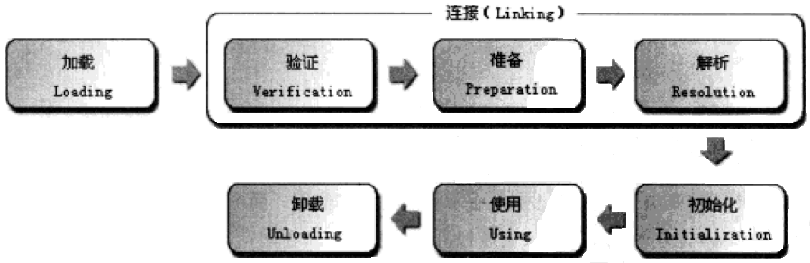

# Java类加载机制
> 整理自[Java虚拟机9：Java类加载机制](http://www.cnblogs.com/xrq730/p/4844915.html)

## 阶段
类从被加载到虚拟机内存中开始，到卸载出内存，它的整个生命周期包括：加载（Loading）、验证（Verification）、准备（Preparation）、解析（Resolution）、初始化（Initiallization）、使用（Using）和卸载（Unloading）这7个阶段。其中验证、准备、解析3个部分统称为连接（Linking），这七个阶段的发生顺序如下图：

图中，加载、验证、准备、初始化、卸载这5个阶段的顺序是确定的，类的加载过程必须按照这种顺序按部就班地开始，而解析阶段不一定：它在某些情况下可以初始化阶段之后在开始，这是为了支持Java语言的运行时绑定（也称为动态绑定）。接下来讲解加载、验证、准备、解析、初始化五个步骤，这五个步骤组成了一个完整的类加载过程。

## 加载
加载是类加载的第一个阶段。有两种时机会触发类加载：
1. 预加载。虚拟机启动时加载，加载的是JAVA_HOME/lib/下的rt.jar下的.class文件，这个jar包里面的内容是程序运行时非常常常用到的，像java.lang.*、java.util.*、java.io.*等等，因此随着虚拟机一起加载。要证明这一点很简单，写一个空的main函数，设置虚拟机参数为"-XX:+TraceClassLoading"来获取类加载信息
2. 运行时加载。虚拟机在用到一个.class文件的时候，会先去内存中查看一下这个.class文件有没有被加载，如果没有就会按照类的全限定名来加载这个类。

> 加载阶段做的三件事情：
> 1. 获取.class文件的二进制流
> 2. 将类信息、静态变量、字节码、常量这些.class文件中的内容放入方法区中
> 3. 在内存中生成一个代表这个.class文件的java.lang.Class对象，作为方法区这个类的各种数据的访问入口。一般这个Class是在堆里的，不过HotSpot虚拟机比较特殊，这个Class对象是放在方法区中的
> 
> 虚拟机规范对这三点的要求并不具体，因此虚拟机实现与具体应用的灵活度都是相当大的。例如第一条，根本没有指明二进制字节流要从哪里来、怎么来，因此单单就这一条，就能变出许多花样来：
> * 从zip包中获取，这就是以后jar、ear、war格式的基础
> * 从网络中获取，典型应用就是Applet
> * 运行时计算生成，典型应用就是动态代理技术
> * 由其他文件生成，典型应用就是JSP，即由JSP生成对应的.class文件
> * 从数据库中读取，这种场景比较少见
> 
> 总而言之，在类加载整个过程中，这部分是对于开发者来说可控性最强的一个阶段。

## 验证
**连接阶段的第一步，这一阶段的目的是为了确保.class文件的字节流中包含的信息符合当前虚拟机的要求，并且不会危害虚拟机自身的安全。**

Java语言本身是相对安全的语言（相对C/C++来说），但是前面说过，.class文件未必要从Java源码编译而来，可以使用任何途径产生，甚至包括用十六进制编辑器直接编写来产生.class文件。在字节码语言层面上，Java代码至少从语义上是可以表达出来的。虚拟机如果不检查输入的字节流，对其完全信任的话，很可能会因为载入了有害的字节流而导致系统崩溃，所以验证是虚拟机对自身保护的一项重要工作。

验证阶段将做一下几个工作，具体就不细讲了，这是虚拟机实现层面的问题：
1. 文件格式验证
2. 元数据验证
3. 字节码验证
4. 符号引用验证

## 准备
**准备阶段是正式为类变量分配内存并设置其初始值的阶段**，这些变量所使用的内存都将在方法区中分配。关于这点，有两个地方注意一下：

1. 这时候进行内存分配的仅仅是类变量（被static修饰的变量），而不是实例变量，实例变量将会在对象实例化的时候随着对象一起分配在Java堆中
2. 这个阶段赋初始值的变量指的是那些不被final修饰的static变量，比如"public static int value = 123;"，value在准备阶段过后是0而不是123，给value赋值为123的动作将在初始化阶段才进行；比如"public static final int value = 123;"就不一样了，在准备阶段，虚拟机就会给value赋值为123。

## 解析
**解析阶段是虚拟机将常量池内的符号引用替换为直接引用的过程。** 
> 符号引用和直接引用的区别：
>
> **符号引用**
> * 类和接口的全限定名
> * 字段的名称和描述符
> * 方法的名称和描述符
> 
> 符号引用是对于类、变量、方法的描述。符号引用和虚拟机的内存布局是没有关系的，引用的目标未必已经加载到内存中了。
>
> **直接引用**
>
> 直接引用可以是直接指向目标的指针、相对偏移量或是一个能间接定位到目标的句柄。直接引用是和虚拟机实现的内存布局相关的，同一个符号引用在不同的虚拟机示例上翻译出来的直接引用一般不会相同。如果有了直接引用，那引用的目标必定已经存在在内存中了。

## 初始化
初始化阶段是类加载过程的最后一步，初始化阶段是真正执行类中定义的Java程序代码（或者说是字节码）的过程。初始化过程是一个执行类构造器`<clinit>()`方法的过程，根据程序员通过程序制定的主观计划去初始化类变量和其它资源。把这句话说白一点，其实**初始化阶段做的事就是给static变量赋予用户指定的值以及执行静态代码块。**

注意一下，虚拟机会保证类的初始化在多线程环境中被正确地加锁、同步，即如果多个线程同时去初始化一个类，那么只会有一个类去执行这个类的`<clinit>()`方法，其他线程都要阻塞等待，直至活动线程执行`<clinit>()`方法完毕。因此如果在一个类的`<clinit>()`方法中有耗时很长的操作，就可能造成多个进程阻塞。不过其他线程虽然会阻塞，但是执行`<clinit>()`方法的那条线程退出`<clinit>()`方法后，其他线程不会再次进入`<clinit>()`方法了，因为同一个类加载器下，一个类只会初始化一次。实际应用中这种阻塞往往是比较隐蔽的，要小心。

Java虚拟机规范严格规定了有且只有5种场景必须立即对类进行初始化，这4种场景也称为对一个类进行主动引用：
1. 使用new关键字实例化对象、读取或者设置一个类的静态字段（被final修饰的静态字段除外）、调用一个类的静态方法的时候
2. 使用java.lang.reflect包中的方法对类进行反射调用的时候
3. 初始化一个类，发现其父类还没有初始化过的时候
4. 虚拟机启动的时候，虚拟机会先初始化用户指定的包含main()方法的那个类
5. 当使用JDK1.7的动态语言支持时，如果一个java.lang.MethodHandle实例最后的解析结果REF_getStatic、REF_putStatic、REF_invokeStatic的方法句柄，并且这个方法句柄所对应的类没有进行过初始化，则需要先触发其初始化。

除了上面5种场景外，所有引用类的方式都不会触发类的初始化，称为被动引用。被动引用的几个例子：
1. 子类引用父类静态字段，不会导致子类初始化。
2. 通过数组定义引用类，不会触发此类的初始化
3. 引用静态常量时，常量在编译阶段会存入类的常量池中，本质上并没有直接引用到定义常量的类